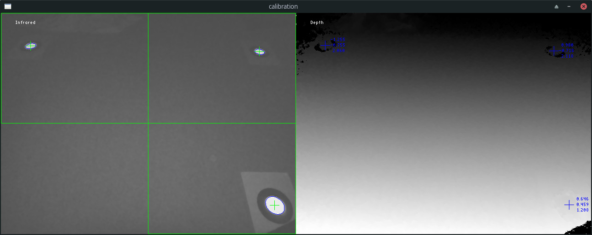
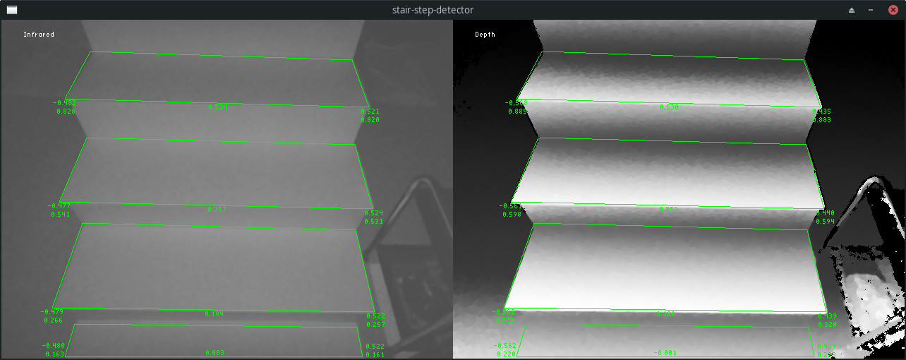
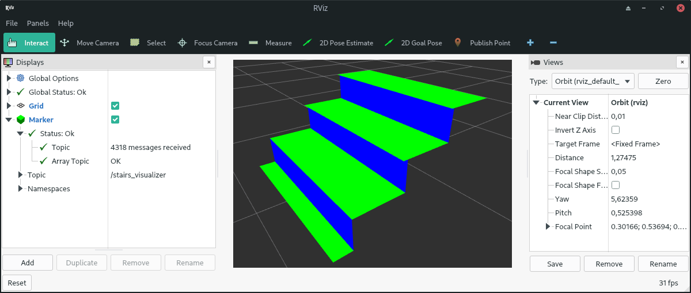

# stair-step-detector
Detection of stair steps using a LiDAR depth camera

### Dependencies
- [Intel RealSense SDK](https://github.com/IntelRealSense/librealsense/releases/latest)
- [OpenCV](https://opencv.org)
- [OpenGL](https://opengl.org)
- [Boost](https://boost.org)
- [ROS](https://ros.org) (only for the ROS2 wrapper)

### Overview

The camera is calibrated with the help of three points in the ground plane.

After calibration, the camera can measure the heights and corner points of the stair steps that are in the measurement area. External world coordinates are displayed on the left.

#### Integration with ROS
If you are familiar with the [Robot Operating System](https://ros.org), you can use the [simple wrapper](https://github.com/peter-nebe/stair-step-detector/tree/master/ros) for [ROS2 Galactic Geochelone](http://docs.ros.org/en/galactic/Releases/Release-Galactic-Geochelone.html). Among other things, it contains a ROS package with which the measured stair steps can be visualized. The display is done with [RViz](http://wiki.ros.org/rviz), the 3D visualization tool for ROS. Here you can see an example:

