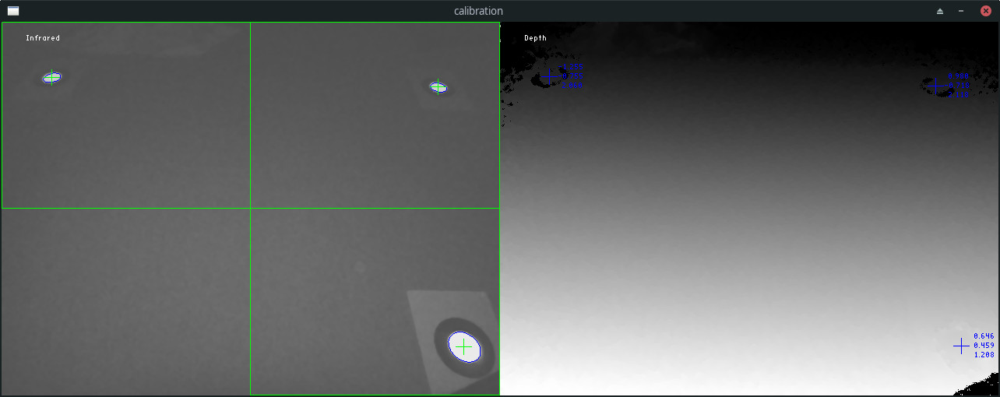
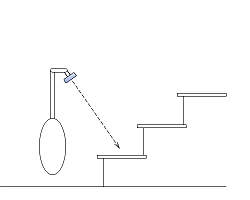
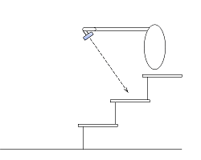
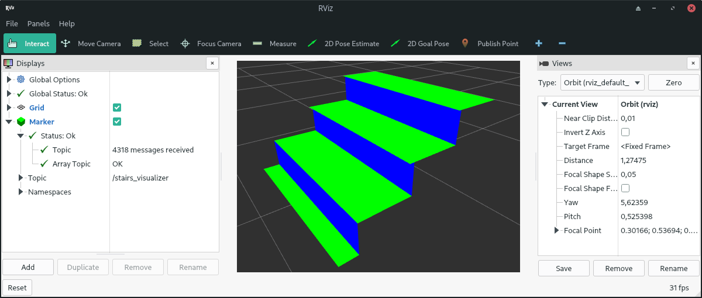
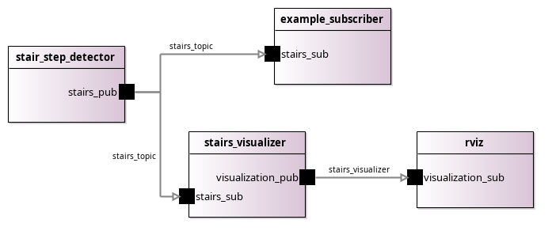

# stair-step-detector
Detection of stair steps using a LiDAR depth camera

### Dependencies
- [Intel RealSense SDK](https://github.com/IntelRealSense/librealsense/releases/latest)
- [OpenCV](https://opencv.org)
- [OpenGL](https://opengl.org)
- [Boost](https://boost.org)
- [ROS](https://ros.org) (only for the ROS2 wrapper)

### Overview

The camera is calibrated with the help of three points in the ground plane.

After calibration, the camera can measure the heights and corner points of the stair steps that are in the measurement area. External world coordinates are displayed on the left.

Knowing the exact positions of the individual steps can help a mobile robot to negotiate stairs, if it is able to do so in principle. For a robot, ascending and descending stairs may be different challenges. But there is only one position and line of sight for the camera to fully capture a step. If the camera is attached to the robot, it must always be brought into the correct measuring position using suitable mechanics. In principle it could look like this:

If the robot is clever, it ensures that the image is not upside down by rotating the camera 180 degrees around the optical axis. If it doesn't, the image has to be rotated (or mirrored) using software. Then the algorithm of the **stair-step-detector** can be used for both ascending and descending stairs.

### The camera used
The **stair-step-detector** currently uses the Intel® RealSense™ LiDAR Camera L515. The depth accuracy of the L515 is better than that of the RealSense stereo cameras. But there can be many reasons why someone might want to use the stair-step-detector with a different camera, from RealSense or another manufacturer. In principle, any depth camera can be used. For this purpose, at least the class [Camera](https://github.com/peter-nebe/stair-step-detector/blob/master/camera.h#L31) must be adapted, and depending on the features of the camera in question, additional classes. The least effort is to be expected with another RealSense camera, because the RealSense SDK can then also be used. The **stair-step-detector** depends on the L515 and the RealSense SDK in the following way:
- An infrared image and the associated depth image are taken for the geometric calibration.
- The calibration marks are localized in the infrared image, and the 3D coordinates are determined for these 2D positions.
- In measurement mode, the SDK delivers [point clouds](https://github.com/peter-nebe/stair-step-detector/blob/master/pointcloud.cpp#L138) in distortion-free Cartesian coordinates.
- For the sake of simplicity, the SDK sample window is used for the [application window](https://github.com/peter-nebe/stair-step-detector/blob/master/window.h#L38).

The adaptation effort would be greatest when using two conventional cameras as a stereo pair, but thanks to OpenCV that is also possible in principle.

### Integration with ROS
If you are familiar with the [Robot Operating System](https://ros.org), you can use the [simple wrapper](https://github.com/peter-nebe/stair-step-detector/tree/master/ros) for [ROS2 Galactic Geochelone](http://docs.ros.org/en/galactic/Releases/Release-Galactic-Geochelone.html). Among other things, it contains a ROS package with which the measured stair steps can be visualized. The display is done with [RViz](http://wiki.ros.org/rviz), the 3D visualization tool for ROS. Here you can see an example:

See [ROS Wiki](http://wiki.ros.org/stair-step-detector) for more details.

### MDE
It becomes even more convenient: If you are interested in Model-Driven Engineering (MDE), you can use the [model](https://github.com/peter-nebe/stair-step-detector/tree/master/model) of the stair-step-detector. You can combine this with other ROS components and create an ROS system without manual coding. The code generation is done by sophisticated and advanced tools.

<kbd>
  
</kbd>

*Diagram of an exemplary ROS system*

You can find the tools you need here: https://github.com/ipa320/ros-model
